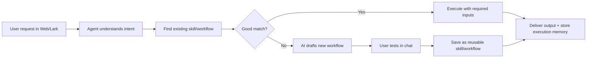

# Operational AI Agent Platform for Teams

A gateway-based, plugin-driven AI agent platform that connects messaging channels (Web UI, Lark) to intelligent agents capable of discovering, executing, and self-healing multi-step AI workflows ("skills").

## What This System Is For

This system is built for operators, founders, sales teams, marketers, and support teams who repeat the same high-value tasks every day but still do them manually in chat.

It turns one-off requests into reusable execution assets:

- **Skills** for focused capabilities (for example, translation, review analysis, image editing).
- **Workflows** for multi-step operations (for example, collect data → transform → generate output → deliver).

### The Core User Challenge

Most teams face the same pattern:

- Requests arrive in chat from many channels.
- The task needs domain context, company standards, and consistent output quality.
- The same work is repeated, but existing chat assistants treat each request as a fresh conversation.

This system addresses this by making execution **stateful, reusable, and governable** instead of purely conversational.

## Problem-to-Solution Story




In short: **Chat is the interface, but reusable operations are the product.**

## What Concrete Needs It Supports

- Standardized customer-facing writing with optional context and tone controls.
- Cross-channel AI operations (Web + Lark) with the same backend logic.
- Multi-step tasks that combine AI reasoning, browser actions, scripts, HTTP calls, and transforms.
- Controlled evolution of capabilities through skill drafts and approval flows.
- Repeatable execution with input validation, fallback handling, and traceable run history.

## How It Differs From Traditional Personal AI Assistants


| Dimension             | Traditional Personal Assistant (e.g. ChatGPT, OpenClaw-style chat agent) | This System                                                   |
| --------------------- | ------------------------------------------------------------------------ | ------------------------------------------------------------- |
| Primary unit of value | Single conversation response                                             | Reusable skill/workflow + execution result                    |
| Reuse model           | User repeats instructions manually                                       | Save once, run repeatedly with structured inputs              |
| Operational control   | Limited governance over agent-created logic                              | Draft-review-approve lifecycle for skill changes              |
| Multi-step execution  | Often prompt-orchestrated, less explicit runtime graph                   | Explicit step graph with typed executors and execution states |
| Channel integration   | Usually one UI at a time                                                 | Unified gateway across Web and Lark                           |
| Team consistency      | Depends on prompt discipline                                             | Company standards + shared reusable assets                    |
| Reliability posture   | Great for ad-hoc help                                                    | Designed for repeated business operations                     |


## Design Principle

This system is not trying to be a smarter chatbot.  
It is trying to be a **durable operations layer** for AI-enabled work.

## Architecture Overview

```
┌─────────────────────┐    ┌──────────────────────┐
│   Control Interfaces │    │  Messaging Channels   │
│                     │    │                      │
│  React Web UI       │    │  Lark Bot            │
│  (localhost:3000)   │    │  (websocket/webhook) │
└────────┬────────────┘    └──────────┬───────────┘
         │ REST + SSE                 │ Normalized messages
         ▼                            ▼
┌─────────────────────────────────────────────────┐
│              Gateway Control Plane               │
│              (Express, port 3001)                │
│                                                 │
│  Channel Router → Session Manager →             │
│                   Agent Supervisor               │
└────────────────────────┬────────────────────────┘
                         │ IPC (child_process)
         ┌───────────────┼───────────────┐
         ▼               ▼               ▼
┌──────────────┐ ┌──────────────┐ ┌──────────────┐
│ Agent Process │ │ Agent Process │ │ Agent Process │
│  (Session A)  │ │  (Session B)  │ │  (Session C)  │
│              │ │              │ │              │
│ AgentRunner  │ │ AgentRunner  │ │ AgentRunner  │
│ PromptBuilder│ │ PromptBuilder│ │ PromptBuilder│
│ ToolExecutor │ │ ToolExecutor │ │ ToolExecutor │
└──────┬───────┘ └──────┬───────┘ └──────┬───────┘
       └────────────────┼────────────────┘
                        ▼
┌─────────────────────────────────────────────────┐
│            Plugin System (shared)                │
│                                                 │
│  Channel    Tool       Memory     Provider      │
│  Plugins    Plugins    Plugins    Plugins        │
│  (Web,      (Skill     (SQLite    (Anthropic,   │
│   Lark)      Mgr,       Vec)      OpenAI,      │
│              Browser,              Google)       │
│              Bash,                              │
│              FileOps)                           │
└─────────────────────────────────────────────────┘
```

### Key Concepts


| Term            | Description                                                                                        |
| --------------- | -------------------------------------------------------------------------------------------------- |
| **Skill**       | A reusable, single-purpose AI capability (e.g., "Product Review Analyzer"). Formerly "Template".   |
| **Workflow**    | A multi-step composed pipeline that chains skills/steps together. Formerly "Recipe".               |
| **Session**     | A conversation between a user (via any channel) and an agent process.                              |
| **Agent**       | An isolated process that handles a session — reasons with an LLM, searches skills, executes tools. |
| **Plugin**      | An extensible module in one of 4 categories: Channel, Tool, Memory, or Provider.                   |
| **Skill Draft** | An agent-proposed edit or new skill that requires human approval before activation.                |


## Tech Stack

- **Frontend**: React 18 + TypeScript + Tailwind CSS + React Router
- **Backend**: Node.js + Express + TypeScript
- **Database**: SQLite with better-sqlite3 (WAL mode for concurrent access)
- **AI Providers**: Anthropic Claude, OpenAI GPT, Google Gemini (pluggable)
- **Messaging**: Lark Open Platform SDK, SSE for web streaming

## Getting Started

### Prerequisites

- Node.js 18+
- npm

### Installation

```bash
# 1. Clone & enter the repo
git clone <repo-url> && cd novohaven-app

# 2. Environment variables
cp .env.example .env
# Edit .env — add your API keys (see Environment section below)

# 3. Install & run server
cd server && npm install && npm run dev
# → http://localhost:3001

# 4. Install & run client (separate terminal)
cd client && npm install && npm start
# → http://localhost:3000
```

### Demo Login

The MVP uses mock auth. Any password works with `demo@novohaven.com`.

## Project Structure

```
novohaven-app/
├── client/                              # React 18 + TypeScript frontend
│   ├── src/
│   │   ├── components/
│   │   │   ├── AgentChat/               # Web channel chat interface (SSE streaming)
│   │   │   ├── SessionMonitor/          # Active session monitoring dashboard
│   │   │   ├── PluginManager/           # Plugin configuration UI
│   │   │   ├── SkillDraftReview/        # Approve/reject agent-proposed skills
│   │   │   ├── Dashboard/              # Landing page with agent health panel
│   │   │   ├── TemplateEditor/          # Skill editor (single-task)
│   │   │   ├── RecipeBuilder/           # Workflow editor + runner
│   │   │   ├── ChatExecution/           # Workflow execution chat UI
│   │   │   ├── WorkflowExecution/       # Execution list + detail views
│   │   │   ├── WorkflowBuilder/         # AI-powered workflow generator
│   │   │   ├── CompanyStandards/        # Brand standards CRUD
│   │   │   ├── OutputsGallery/          # Output browser
│   │   │   └── common/                  # Reusable UI primitives
│   │   ├── context/                     # React Context (Auth, Language, Notification)
│   │   ├── hooks/                       # Custom hooks
│   │   ├── i18n/                        # Translation dictionaries (en/zh)
│   │   ├── services/                    # API client
│   │   └── types/                       # TypeScript types
│   └── package.json
│
├── server/                              # Node.js + Express backend
│   ├── src/
│   │   ├── gateway/                     # Gateway Control Plane
│   │   │   ├── sessionManager.ts        # Session lifecycle + message history
│   │   │   ├── channelRouter.ts         # Routes channel plugins to agent supervisor
│   │   │   └── agentSupervisor.ts       # Spawns/manages agent child processes
│   │   ├── agent/                       # Agent Runtime (per-session process)
│   │   │   ├── process.ts               # Child process entry point (IPC bridge)
│   │   │   ├── AgentRunner.ts           # 5-step agentic loop
│   │   │   ├── PromptBuilder.ts         # Multi-layer context assembly
│   │   │   └── ToolExecutor.ts          # Tool call dispatch to plugins
│   │   ├── plugins/                     # Plugin System
│   │   │   ├── types.ts                 # Plugin interfaces (4 types)
│   │   │   ├── registry.ts              # Plugin registry singleton
│   │   │   ├── loader.ts                # Manifest-based plugin discovery
│   │   │   ├── builtin/                 # Built-in plugins
│   │   │   │   ├── channel-web/         # Web UI channel (REST + SSE)
│   │   │   │   ├── channel-lark/        # Lark bot channel (websocket + webhook)
│   │   │   │   ├── provider-anthropic/  # Claude models
│   │   │   │   ├── provider-openai/     # GPT models
│   │   │   │   ├── provider-google/     # Gemini models
│   │   │   │   ├── tool-skill-manager/  # Skill CRUD tools for agents
│   │   │   │   ├── tool-browser/        # Browser automation
│   │   │   │   ├── tool-bash/           # Shell execution
│   │   │   │   ├── tool-fileops/        # File read/write
│   │   │   │   └── memory-sqlite-vec/   # Vector search (sqlite-vec)
│   │   │   └── community/              # User-installed plugins (gitignored)
│   │   ├── routes/                      # Express routers
│   │   ├── services/                    # Business logic
│   │   ├── executors/                   # Step executor plugin system (workflow steps)
│   │   ├── models/
│   │   │   └── database.ts             # Schema, migrations, seeds (better-sqlite3)
│   │   ├── middleware/                  # Auth middleware
│   │   ├── types/                       # Server-side type definitions
│   │   └── index.ts                     # Express entry point + gateway wiring
│   ├── data/                            # SQLite database file
│   └── package.json
│
├── docs/plans/                          # Architecture design documents
├── .env.example                         # Environment variable template
└── README.md
```

## Plugin System

NovoHaven uses a plugin architecture with 4 categories. Each plugin has a `manifest.json` and an entry point module.

### Plugin Types


| Type         | Purpose                                                      | Built-in Plugins                                                  |
| ------------ | ------------------------------------------------------------ | ----------------------------------------------------------------- |
| **Channel**  | Messaging adapters that normalize platform-specific messages | `channel-web` (REST + SSE), `channel-lark` (websocket + webhook)  |
| **Tool**     | Agent-callable capabilities exposed as LLM tools             | `tool-skill-manager`, `tool-browser`, `tool-bash`, `tool-fileops` |
| **Memory**   | Search and vector indexing for skill discovery               | `memory-sqlite-vec`                                               |
| **Provider** | LLM backends for streaming completions                       | `provider-anthropic`, `provider-openai`, `provider-google`        |


### Creating a Plugin

1. Create a directory under `server/src/plugins/builtin/` (or `community/` for user plugins):

```
server/src/plugins/builtin/my-plugin/
  manifest.json
  index.ts
```

1. Write `manifest.json`:

```json
{
  "name": "my-plugin",
  "version": "1.0.0",
  "type": "tool",
  "displayName": "My Plugin",
  "description": "Does something useful",
  "entry": "./index.ts",
  "config": {
    "type": "object",
    "properties": {
      "apiKey": { "type": "string", "secret": true }
    }
  }
}
```

1. Implement the appropriate interface from `server/src/plugins/types.ts`:

```typescript
import { ToolPlugin, PluginManifest, ToolDefinition, ToolContext, ToolResult } from '../../types';

export default class MyPlugin implements ToolPlugin {
  manifest: PluginManifest;

  constructor(manifest: PluginManifest) {
    this.manifest = manifest;
  }

  async initialize(config: Record<string, any>): Promise<void> {
    // Setup with config from DB or defaults
  }

  async shutdown(): Promise<void> {
    // Cleanup
  }

  getTools(): ToolDefinition[] {
    return [{
      name: 'my-plugin:action',
      description: 'Does the action',
      parameters: { type: 'object', properties: { input: { type: 'string' } } }
    }];
  }

  async execute(toolName: string, args: Record<string, any>, context: ToolContext): Promise<ToolResult> {
    return { success: true, output: 'Result here' };
  }
}
```

1. The plugin loader automatically discovers and registers it on server startup. Enable/disable and configure via the Plugin Manager UI or the `plugin_configs` DB table.

### Plugin Interfaces

```typescript
// Channel Plugin — messaging adapter
interface ChannelPlugin extends Plugin {
  parseInbound(req: Request): ChannelMessage | null;
  sendOutbound(channelId: string, response: AgentResponse): Promise<void>;
  verifyAuth(req: Request): boolean;
  registerRoutes(router: Router): void;
}

// Tool Plugin — agent-callable tools
interface ToolPlugin extends Plugin {
  getTools(): ToolDefinition[];
  execute(toolName: string, args: Record<string, any>, context: ToolContext): Promise<ToolResult>;
}

// Memory Plugin — search and indexing
interface MemoryPlugin extends Plugin {
  index(item: SkillIndexEntry): Promise<void>;
  search(query: string, options?: SearchOptions): Promise<SearchResult[]>;
  storeMemory(sessionId: string, content: string, embedding?: number[]): Promise<void>;
  searchMemory(sessionId: string, query: string, limit?: number): Promise<MemoryEntry[]>;
}

// Provider Plugin — LLM backends
interface ProviderPlugin extends Plugin {
  listModels(): ModelInfo[];
  stream(request: CompletionRequest): AsyncIterable<StreamEvent>;
  embed?(texts: string[]): Promise<number[][]>;
}
```

## Agent Runtime

Each agent session runs in an isolated child process with a 5-step agentic loop:

1. **Resolve Session** — load session state and conversation history from DB
2. **Assemble Context** — PromptBuilder layers system prompt, tools, relevant skills, execution state, and history
3. **Stream LLM** — call the configured provider plugin with tools enabled
4. **Execute Tool Calls** — dispatch tool calls to plugins (skill management, browser, bash, etc.)
5. **Persist State** — save messages and tool results to `session_messages` table

The agent can search for relevant skills, execute workflows, test skills, propose edits (as drafts), and request user approval — all via tool calls.

### Agent Tools


| Tool               | Description                                              |
| ------------------ | -------------------------------------------------------- |
| `skill:search`     | Find relevant skills/workflows by description            |
| `skill:execute`    | Run a skill/workflow with given inputs                   |
| `skill:test`       | Test a skill with sample inputs (no persist)             |
| `skill:edit`       | Propose edits to a skill (creates a draft for review)    |
| `skill:create`     | Propose a new skill (creates a draft)                    |
| `skill:validate`   | Check a skill for errors (missing variables, bad config) |
| `approval:request` | Ask the user for approval before proceeding              |


## API Endpoints

### Gateway & Sessions


| Method | Path                      | Description                      |
| ------ | ------------------------- | -------------------------------- |
| `GET`  | `/api/sessions`           | List active sessions             |
| `GET`  | `/api/sessions/:id`       | Get session detail with messages |
| `POST` | `/api/sessions/:id/close` | Close a session                  |


### Agent Configuration


| Method | Path              | Description         |
| ------ | ----------------- | ------------------- |
| `GET`  | `/api/agents`     | List agent configs  |
| `POST` | `/api/agents`     | Create agent config |
| `GET`  | `/api/agents/:id` | Get agent config    |
| `PUT`  | `/api/agents/:id` | Update agent config |


### Plugins


| Method | Path                 | Description                           |
| ------ | -------------------- | ------------------------------------- |
| `GET`  | `/api/plugins`       | List all plugins with status          |
| `PUT`  | `/api/plugins/:name` | Update plugin config (enable/disable) |


### Skills


| Method   | Path                    | Description          |
| -------- | ----------------------- | -------------------- |
| `GET`    | `/api/skills`           | List all skills      |
| `POST`   | `/api/skills`           | Create a skill       |
| `GET`    | `/api/skills/:id`       | Get skill with steps |
| `PUT`    | `/api/skills/:id`       | Update a skill       |
| `DELETE` | `/api/skills/:id`       | Delete a skill       |
| `POST`   | `/api/skills/:id/clone` | Clone a skill        |


### Workflows


| Method   | Path                 | Description             |
| -------- | -------------------- | ----------------------- |
| `GET`    | `/api/workflows`     | List all workflows      |
| `POST`   | `/api/workflows`     | Create a workflow       |
| `GET`    | `/api/workflows/:id` | Get workflow with steps |
| `PUT`    | `/api/workflows/:id` | Update a workflow       |
| `DELETE` | `/api/workflows/:id` | Delete a workflow       |


### Skill Drafts (Agent-Proposed Changes)


| Method | Path                           | Description             |
| ------ | ------------------------------ | ----------------------- |
| `GET`  | `/api/skillDrafts`             | List pending drafts     |
| `GET`  | `/api/skillDrafts/:id`         | Get draft detail        |
| `PUT`  | `/api/skillDrafts/:id/approve` | Approve and apply draft |
| `PUT`  | `/api/skillDrafts/:id/reject`  | Reject draft            |


### Channel Endpoints


| Method | Path                             | Description                                                |
| ------ | -------------------------------- | ---------------------------------------------------------- |
| `POST` | `/channels/channel-web/message`  | Send message to agent (web)                                |
| `GET`  | `/channels/channel-web/stream`   | SSE stream for responses (web)                             |
| `POST` | `/channels/channel-lark/webhook` | Lark event subscription webhook (optional in webhook mode) |


### Legacy Endpoints (preserved)


| Group      | Prefix            | Key Endpoints                     |
| ---------- | ----------------- | --------------------------------- |
| Recipes    | `/api/recipes`    | CRUD (backward compat)            |
| Executions | `/api/executions` | CRUD + approve/reject/retry steps |
| Standards  | `/api/standards`  | CRUD                              |
| AI         | `/api/ai`         | Models, providers, test           |
| Outputs    | `/api/outputs`    | Browse execution outputs          |
| Usage      | `/api/usage`      | API usage tracking                |


## Lark Integration

The `channel-lark` plugin enables bot interactions in Lark (group chats and DMs).

### Setup

1. Create a Lark app at [open.larksuite.com](https://open.larksuite.com)
2. Enable bot capabilities
3. Choose inbound mode:
  - `websocket` (default): no public inbound webhook endpoint required
  - `webhook`: set webhook URL to `https://<your-server>/channels/channel-lark/webhook`
4. Subscribe to events: `im.message.receive_v1`
5. Configure the plugin via the Plugin Manager UI or directly in the `plugin_configs` table:

```json
{
  "appId": "cli_xxxx",
  "appSecret": "your-app-secret",
  "connectionMode": "websocket",
  "verificationToken": "your-verification-token",
  "requireMention": true,
  "textChunkLimit": 3800,
  "mediaMaxMb": 30
}
```

### Message Flow

```
User @mentions bot in Lark → Lark websocket/webhook event → channel-lark plugin →
  ChannelRouter → SessionManager → AgentSupervisor → Agent Process →
  LLM response → AgentSupervisor → channel-lark sendOutbound → Lark API → User
```

Features:

- @mention detection in group chats
- Thread support via Lark's `root_id`
- Event deduplication (size-bounded + TTL cache)
- Supports inbound media/file download and attachment forwarding
- Supports outbound media/file upload and send

## Environment Variables

```bash
# Server
PORT=3001
CLIENT_URL=http://localhost:3000
DATABASE_PATH=./data/novohaven.db

# AI Providers (add the ones you use)
OPENAI_API_KEY=sk-your-key-here
ANTHROPIC_API_KEY=sk-ant-your-key-here
GOOGLE_API_KEY=AIza-your-key-here

# Client
REACT_APP_API_URL=http://localhost:3001/api
```

Provider API keys can also be configured per-plugin via the Plugin Manager UI or the `plugin_configs` table. The app works without any AI keys using the Mock provider for testing.

## Database

- **Engine**: better-sqlite3 (native SQLite, file-based, auto-persists)
- **WAL mode**: enabled for concurrent reads from agent child processes
- **Location**: `server/data/novohaven.db`
- **Migrations**: applied on startup in `initializeDatabase()` — no separate migration framework

### Key Tables


| Table                 | Purpose                                                        |
| --------------------- | -------------------------------------------------------------- |
| `skills`              | Reusable single-purpose AI capabilities                        |
| `workflows`           | Multi-step composed pipelines                                  |
| `skill_steps`         | Steps within skills or workflows (`parent_type` discriminator) |
| `sessions`            | Agent conversation sessions across channels                    |
| `session_messages`    | Conversation history per session                               |
| `agent_configs`       | Per-agent settings (model, system prompt, allowed tools)       |
| `plugin_configs`      | Plugin enable/disable and configuration                        |
| `skill_drafts`        | Agent-proposed edits awaiting human approval                   |
| `workflow_executions` | Running/completed workflow executions                          |
| `step_executions`     | Individual step results within executions                      |


## Authentication

The MVP uses mock authentication with a demo user. In production, replace with proper JWT authentication.

- Email: `demo@novohaven.com`
- Password: (any value)

## License

MIT